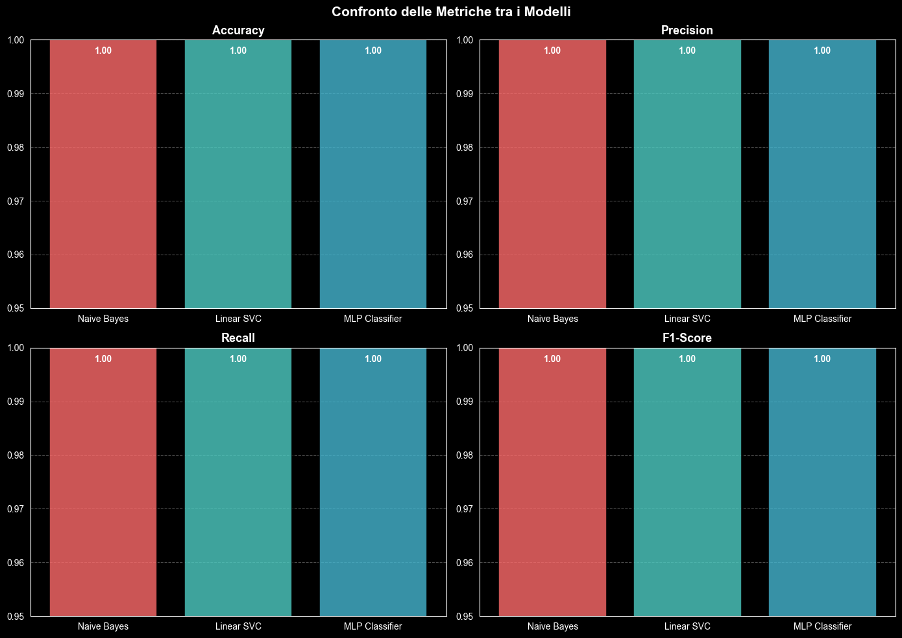
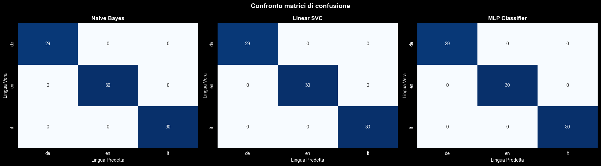

# 🌐 Language Identification — MuseumLangID

> **Progetto Finale** del corso *"Fundamentals of AI for Developers"* — [Profession.AI](https://profession.ai)

---

## 📖 Descrizione del Progetto

**MuseumLangID** è un sistema di Machine Learning per l'identificazione automatica della lingua di testi museali. Il
progetto nasce dalla necessità di un museo internazionale di classificare automaticamente le descrizioni delle proprie
opere d'arte, scritte in più lingue, eliminando la necessità di un'analisi manuale.

Il modello è in grado di riconoscere la lingua di un testo tra **Italiano**, **Inglese** e **Tedesco**, con accuratezza
del 100% sul dataset fornito.

---

## 🏛️ Caso d'Uso Aziendale

Il museo ospita una vasta collezione di opere d'arte con descrizioni in diverse lingue. Il personale aveva necessità di
uno strumento per:

- **Automatizzare** l'identificazione della lingua di ogni testo
- **Processare** rapidamente grandi volumi di descrizioni
- **Ridurre** gli errori umani nella classificazione

---

## 📊 Dataset

| Proprietà         | Valore                                               |
|-------------------|------------------------------------------------------|
| Totale campioni   | 294                                                  |
| Lingue supportate | 3 (IT, EN, DE)                                       |
| Distribuzione     | Bilanciata (98 campioni per lingua, 33.33% ciascuna) |
| Colonne           | `Testo`, `Codice Lingua`                             |
| Valori mancanti   | Nessuno                                              |

**Fonte:
** [Dataset su GitHub (Profession AI)](https://raw.githubusercontent.com/Profession-AI/progetti-ml/refs/heads/main/Modello%20per%20l%27identificazione%20della%20lingua%20dei%20testi%20di%20un%20museo/museo_descrizioni.csv)

---

## ⚙️ Pipeline

```
Dataset CSV
    │
    ▼
┌───────────────────────────┐
│   Data Preprocessing      │
│  - Lowercase              │
│  - Rimozione punteggiatura│
│  - Rimozione numeri       │
│  - Rimozione spazi extra  │
└───────────────────────────┘
    │
    ▼
┌───────────────────────────┐
│  Train/Test Split         │
│  70% Train / 30% Test     │
│  (stratificato)           │
└───────────────────────────┘
    │
    ▼
┌───────────────────────────┐
│  TF-IDF Vectorization     │
│  ngram_range = (1, 2)     │
│  Vocabolario: 1568 feat.  │
└───────────────────────────┘
    │
    ▼
┌───────────────────────────┐
│     Modelli ML            │
│  1. Naive Bayes           │
│  2. LinearSVC             │
│  3. MLP Classifier        │
└───────────────────────────┘
    │
    ▼
┌───────────────────────────┐
│      Valutazione          │
│  Accuracy, Precision,     │
│  Recall, F1-Score         │
└───────────────────────────┘
```

### Scelte di Preprocessing

- **Nessuna lemmatizzazione**: richiederebbe conoscere la lingua in anticipo (dipendenza circolare); inoltre la
  morfologia (es. suffissi `-ings`, `-endo`, prefisso `ge-`) è informativa per la language identification.
- **Stopwords mantenute**: articoli e preposizioni sono altamente discriminativi tra le lingue (es. `"the"`, `"il"`,
  `"der"`).
- **Bigrammi inclusi**: sequenze come `"de la"`, `"of the"`, `"in der"` aumentano la capacità discriminativa del
  modello.

---

## 🤖 Modelli

| Modello                     | Descrizione                                                                                                          |
|-----------------------------|----------------------------------------------------------------------------------------------------------------------|
| **Multinomial Naive Bayes** | Classificatore probabilistico bayesiano, adatto per dati TF-IDF                                                      |
| **LinearSVC**               | Support Vector Machine lineare, efficace per text classification                                                     |
| **MLP Classifier**          | Rete neurale feed-forward con 2 layer nascosti (256 → 128 neuroni), attivazione ReLU, ottimizzatore Adam, 150 epoche |

---

## 📈 Risultati

Tutti e tre i modelli raggiungono **prestazioni perfette** sul test set:

| Modello        | Accuracy | Precision | Recall   | F1-Score |
|----------------|----------|-----------|----------|----------|
| Naive Bayes    | **1.00** | **1.00**  | **1.00** | **1.00** |
| LinearSVC      | **1.00** | **1.00**  | **1.00** | **1.00** |
| MLP Classifier | **1.00** | **1.00**  | **1.00** | **1.00** |

### Confronto Metriche



### Matrici di Confusione



---

## ✅ Modello Consigliato per la Produzione

**Naive Bayes Multinomiale** o **LinearSVC**, perché:

- Training e inferenza più veloci rispetto alla rete neurale
- Nessun iperparametro critico da ottimizzare (learning rate, architettura)
- Risultati equivalenti a costi computazionali inferiori

---

## 🔧 Tecnologie Utilizzate

- **Python 3.13**
- [scikit-learn](https://scikit-learn.org/) — modelli ML e metriche
- [pandas](https://pandas.pydata.org/) — gestione del dataset
- [numpy](https://numpy.org/) — operazioni numeriche
- [matplotlib](https://matplotlib.org/) + [seaborn](https://seaborn.pydata.org/) — visualizzazioni

---

## 🚀 Come Eseguire il Progetto

1. **Clona il repository:**
   ```bash
   git clone https://github.com/<tuo-username>/Language_Identification.git
   cd Language_Identification
   ```

2. **Installa le dipendenze:**
   ```bash
   pip install scikit-learn pandas numpy matplotlib seaborn jupyter
   ```

3. **Avvia il notebook:**
   ```bash
   jupyter notebook "Language Identification - Progetto Finale.ipynb"
   ```

---

## 🔭 Possibili Miglioramenti

- **Character n-grams**: usare n-grammi a livello di carattere anziché di parola potrebbe rendere il modello più robusto
  in scenari con più lingue, errori di battitura o testi molto brevi.
- **Estensione multilingue**: aggiungere altre lingue (es. Francese, Spagnolo) aumentando la complessità del task.
- **API REST**: esporre il modello come servizio HTTP per l'integrazione con il sistema museale esistente.

---

## 📄 Licenza

Distribuito sotto licenza MIT. Vedi il file [LICENSE](LICENSE) per i dettagli.
